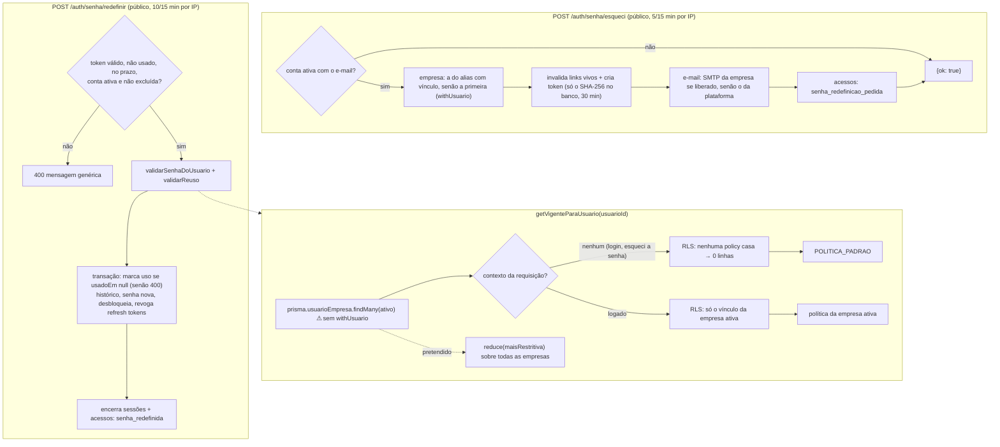

# Fluxograma — Módulos `politica-senha` e `recuperacao-senha`

```mermaid
flowchart TD
    subgraph Politica["getVigenteParaUsuario(usuarioId)"]
      P0["prisma.usuarioEmpresa.findMany(ativo) ⚠ sem withUsuario"] --> P1{"contexto da requisição?"}
      P1 -- "nenhum (login, esqueci a senha)" --> P2["RLS: nenhuma policy casa → 0 linhas"]
      P1 -- "logado" --> P3["RLS: só o vínculo da empresa ativa"]
      P2 --> PD["POLITICA_PADRAO"]
      P3 --> PE["política da empresa ativa"]
      P0 -. "pretendido" .-> PR["reduce(maisRestritiva) sobre todas as empresas"]
    end

    subgraph Esqueci["POST /auth/senha/esqueci (público, 5/15 min por IP)"]
      E1{"conta ativa com o e-mail?"} -- não --> OK1["{ok: true}"]
      E1 -- sim --> E2["empresa: a do alias com vínculo, senão a primeira (withUsuario)"]
      E2 --> E3["invalida links vivos + cria token (só o SHA-256 no banco, 30 min)"]
      E3 --> E4["e-mail: SMTP da empresa se liberado, senão o da plataforma"]
      E4 --> E5["acessos: senha_redefinicao_pedida"] --> OK1
    end

    subgraph Redefinir["POST /auth/senha/redefinir (público, 10/15 min por IP)"]
      R1{"token válido, não usado, no prazo,<br/>conta ativa e não excluída?"} -- não --> R400["400 mensagem genérica"]
      R1 -- sim --> R2["validarSenhaDoUsuario + validarReuso"]
      R2 --> R3["transação: marca uso se usadoEm null (senão 400)<br/>histórico, senha nova, desbloqueia, revoga refresh tokens"]
      R3 --> R4["encerra sessões + acessos: senha_redefinida"]
    end

    R2 -.-> Politica
```
