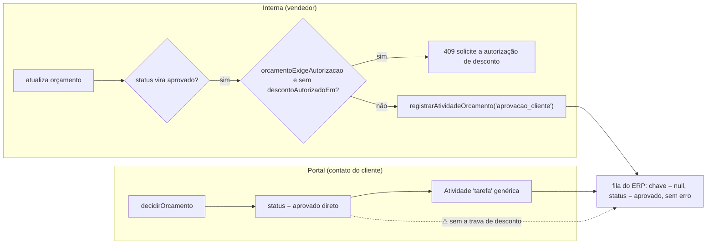

# Fluxograma — `PortalClienteService.decidirOrcamento`

Comparação com a aprovação **interna** (`OrcamentosService`): o que o portal pula.

```mermaid
flowchart LR
    subgraph Interna["Interna (vendedor)"]
      I1["atualiza orçamento"] --> I2{"status vira aprovado?"}
      I2 -- sim --> I3{"orcamentoExigeAutorizacao e sem descontoAutorizadoEm?"}
      I3 -- sim --> I409["409 solicite a autorização de desconto"]
      I3 -- não --> I4["registrarAtividadeOrcamento('aprovacao_cliente')"]
    end

    subgraph Portal["Portal (contato do cliente)"]
      P1["decidirOrcamento"] --> P2["status = aprovado direto"]
      P2 --> P3["Atividade 'tarefa' genérica"]
    end

    I4 --> F["fila do ERP: chave = null, status = aprovado, sem erro"]
    P3 --> F
    P2 -. "⚠ sem a trava de desconto" .-> F
```
