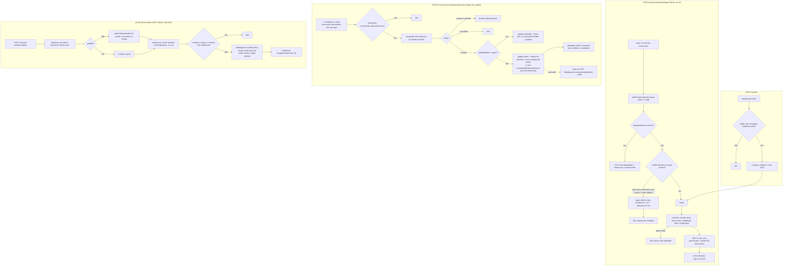

# Fluxograma — Módulo `portal-cliente`

```mermaid
flowchart TD
    subgraph Login["POST /portal-cliente/auth/login (10/min por IP)"]
      L1["alias e e-mail em minúsculas"] --> L2["withPortalCredential: busca (alias, e-mail)"]
      L2 --> L3{"bloqueadoAte no futuro?"}
      L3 -- sim --> L423["423 conta bloqueada ⚠ revela que o e-mail existe"]
      L3 -- não --> L4{"credencial ativa e bcrypt confere?"}
      L4 -- "não (sem credencial: sem bcrypt ⚠ mais rápido)" --> L5["login_falha no log; tentativas+1; ≥5 → bloqueia 15 min"]
      L5 --> L401[401 credenciais inválidas]
      L4 -- sim --> E["emitir"]
      E --> CT["contexto: contato ativo, cliente ativo, habilitação ativa, config ativa"]
      CT -- "algum falha" --> L401b[401 acesso não habilitado]
      CT --> JT["JWT 15 min com permissoes + refresh 30 dias (hash)"]
      JT --> L6["zera tentativas; login_sucesso"]
    end

    subgraph Refresh["POST /refresh"]
      R1["sessão pelo hash"] --> R2{"válida, não revogada, credencial ativa?"}
      R2 -- não --> R401[401]
      R2 -- sim --> R3["revoga a antiga (⚠ sem lock)"] --> E
    end

    subgraph Decidir["PATCH /orcamentos/:id/aprovar|recusar (token do contato)"]
      D0["⚠ strategy só valida assinatura: permissões vêm do token"] --> D1{"permissão orcamentos.aprovar/recusar?"}
      D1 -- não --> D403[403]
      D1 -- sim --> D2["orçamento da empresa e do cliente do token"]
      D2 --> D3{"status"}
      D3 -- "já igual à decisão" --> DOK["devolve (idempotente)"]
      D3 -- "≠ enviado" --> D409[409]
      D3 -- enviado --> D4{"dataValidade &lt; agora?"}
      D4 -- sim --> D5["update expirado + throw 409 ⚠ a transação desfaz o update"]
      D4 -- não --> D6["update status + dados da decisão ⚠ sem condição de status<br/>⚠ sem orcamentoExigeAutorizacao (trava de desconto)"]
      D6 --> D7["Atividade 'tarefa' concluída (sem notificar o vendedor)"]
      D6 -. "aprovado" .-> FILA["entra em GET /integracao/orcamentos/pendentes → ERP"]
    end

    subgraph Admin["portal-cliente-admin (JWT interno, sem tela)"]
      A1["POST acessos (clientes.editar)"] --> A2["empresa com alias e acessível; cliente ativo"]
      A2 --> A3{"perfilId?"}
      A3 -- não --> A4["perfil 'Administrador do cliente' com todas as rotinas"]
      A3 -- sim --> A5["confere o perfil"]
      A4 --> A6["contato por e-mail: atualiza ⚠ principal/ativo, ou cria"]
      A5 --> A6
      A6 --> A7{"contato ou (alias, e-mail) já tem credencial?"}
      A7 -- sim --> A409[409]
      A7 -- não --> A8["habilitação do cliente ativa; config criada ativa (se existir inativa, segue inativa)"]
      A8 --> A9["credencial: bcrypt(senhaInicial, 12)"]
    end
```
