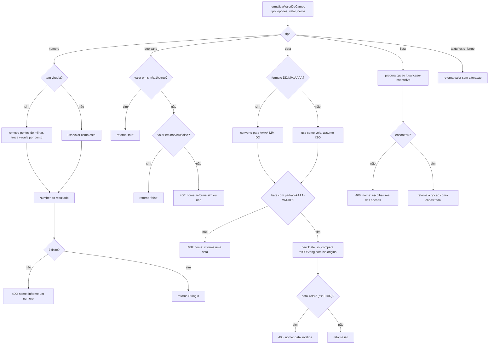

# Fluxograma de função — `normalizarValorDoCampo`

```mermaid
flowchart TD
    Start[normalizarValorDoCampo tipo, opcoes, valor, nome] --> F1{tipo}
    F1 -- numero --> N1{tem virgula?}
    N1 -- sim --> N2[remove pontos de milhar, troca virgula por ponto]
    N1 -- não --> N3[usa valor como esta]
    N2 --> N4[Number do resultado]
    N3 --> N4
    N4 --> N5{é finito?}
    N5 -- não --> X1["400: nome: informe um numero"]
    N5 -- sim --> R1[retorna String n]

    F1 -- booleano --> B1{valor em sim/s/1/x/true?}
    B1 -- sim --> R2["retorna 'true'"]
    B1 -- não --> B2{valor em nao/n/0/false?}
    B2 -- sim --> R3["retorna 'false'"]
    B2 -- não --> X2["400: nome: informe sim ou nao"]

    F1 -- data --> D1{formato DD/MM/AAAA?}
    D1 -- sim --> D2[converte para AAAA-MM-DD]
    D1 -- não --> D3[usa como veio, assume ISO]
    D2 --> D4{bate com padrao AAAA-MM-DD?}
    D3 --> D4
    D4 -- não --> X3["400: nome: informe uma data"]
    D4 -- sim --> D5[new Date iso, compara toISOString com iso original]
    D5 --> D6{"data 'rolou' (ex: 31/02)?"}
    D6 -- sim --> X4["400: nome: data invalida"]
    D6 -- não --> R4[retorna iso]

    F1 -- lista --> L1[procura opcao igual case-insensitive]
    L1 --> L2{encontrou?}
    L2 -- não --> X5["400: nome: escolha uma das opcoes"]
    L2 -- sim --> R5[retorna a opcao como cadastrada]

    F1 -- "texto/texto_longo" --> R6[retorna valor sem alteracao]
```
