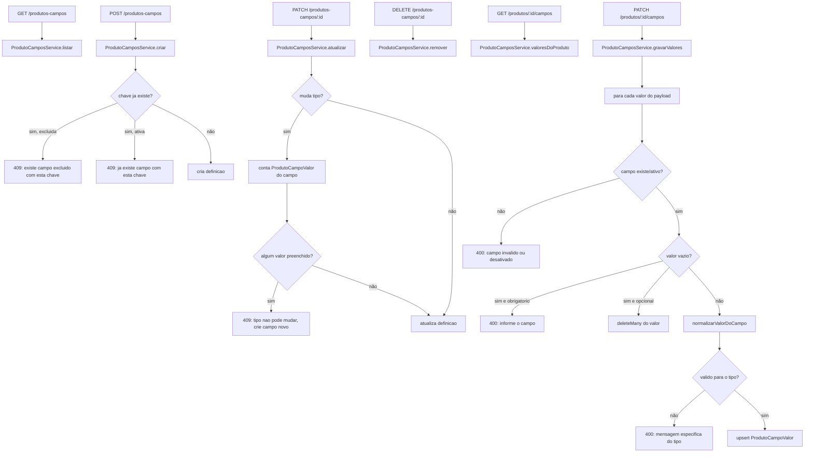

# Fluxograma — Módulo `produto-campos`

```mermaid
flowchart TD
    A["GET /produtos-campos"] --> S1[ProdutoCamposService.listar]
    B["POST /produtos-campos"] --> S2[ProdutoCamposService.criar]
    C["PATCH /produtos-campos/:id"] --> S3[ProdutoCamposService.atualizar]
    D["DELETE /produtos-campos/:id"] --> S4[ProdutoCamposService.remover]
    E["GET /produtos/:id/campos"] --> S5[ProdutoCamposService.valoresDoProduto]
    F["PATCH /produtos/:id/campos"] --> S6[ProdutoCamposService.gravarValores]

    S2 --> F1{chave ja existe?}
    F1 -- "sim, excluida" --> X1[409: existe campo excluido com esta chave]
    F1 -- "sim, ativa" --> X2[409: ja existe campo com esta chave]
    F1 -- não --> F2[cria definicao]

    S3 --> F3{muda tipo?}
    F3 -- sim --> F4[conta ProdutoCampoValor do campo]
    F4 --> F5{algum valor preenchido?}
    F5 -- sim --> X3[409: tipo nao pode mudar, crie campo novo]
    F5 -- não --> F6[atualiza definicao]
    F3 -- não --> F6

    S6 --> F7[para cada valor do payload]
    F7 --> F8{campo existe/ativo?}
    F8 -- não --> X4[400: campo invalido ou desativado]
    F8 -- sim --> F9{valor vazio?}
    F9 -- "sim e obrigatorio" --> X5[400: informe o campo]
    F9 -- "sim e opcional" --> F10[deleteMany do valor]
    F9 -- não --> F11[normalizarValorDoCampo]
    F11 --> F12{valido para o tipo?}
    F12 -- não --> X6[400: mensagem especifica do tipo]
    F12 -- sim --> F13[upsert ProdutoCampoValor]
```
