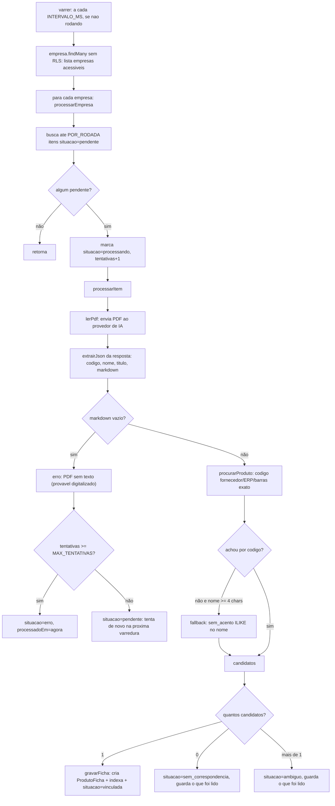

# Fluxograma de função — `FichaImportacaoService.processarItem` (varredura de fichas)

```mermaid
flowchart TD
    Start[varrer: a cada INTERVALO_MS, se nao rodando] --> F1[empresa.findMany sem RLS: lista empresas acessiveis]
    F1 --> F2[para cada empresa: processarEmpresa]
    F2 --> F3[busca ate POR_RODADA itens situacao=pendente]
    F3 --> F4{algum pendente?}
    F4 -- não --> End0[retorna]
    F4 -- sim --> F5[marca situacao=processando, tentativas+1]
    F5 --> F6[processarItem]

    F6 --> F7[lerPdf: envia PDF ao provedor de IA]
    F7 --> F8[extrairJson da resposta: codigo, nome, titulo, markdown]
    F8 --> F9{markdown vazio?}
    F9 -- sim --> X1["erro: PDF sem texto (provavel digitalizado)"]
    F9 -- não --> F10[procurarProduto: codigo fornecedor/ERP/barras exato]
    F10 --> F11{achou por codigo?}
    F11 -- não e nome >= 4 chars --> F12[fallback: sem_acento ILIKE no nome]
    F11 -- sim --> F13[candidatos]
    F12 --> F13
    F13 --> F14{quantos candidatos?}
    F14 -- 1 --> F15[gravarFicha: cria ProdutoFicha + indexa + situacao=vinculada]
    F14 -- 0 --> F16[situacao=sem_correspondencia, guarda o que foi lido]
    F14 -- "mais de 1" --> F17[situacao=ambiguo, guarda o que foi lido]

    X1 --> F18{tentativas >= MAX_TENTATIVAS?}
    F18 -- sim --> F19[situacao=erro, processadoEm=agora]
    F18 -- não --> F20[situacao=pendente: tenta de novo na proxima varredura]
```
