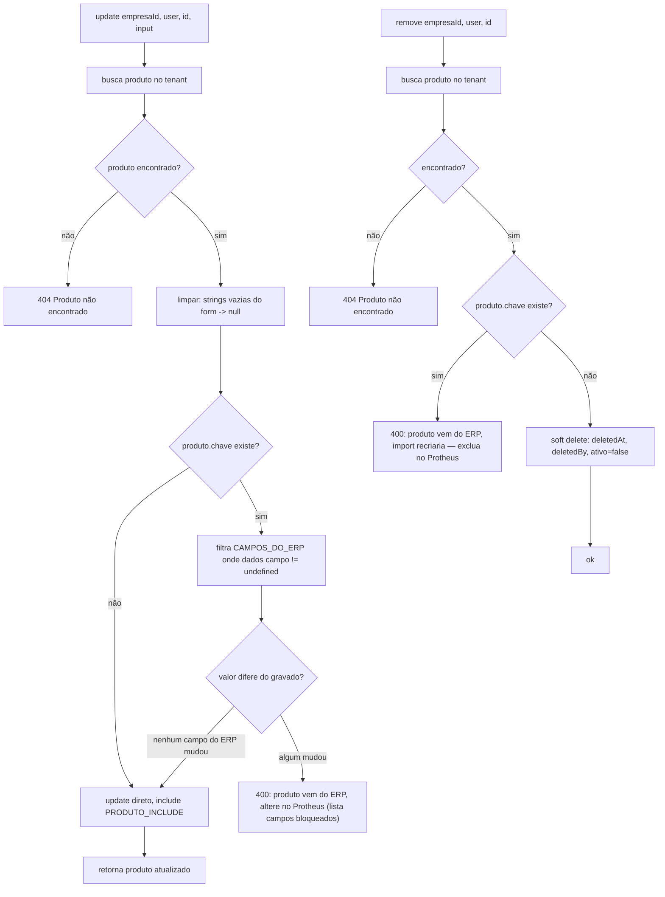

# Fluxograma de função — `ProdutosService.update`/`remove` (trava de campos do ERP)

```mermaid
flowchart TD
    Start[update empresaId, user, id, input] --> F1[busca produto no tenant]
    F1 --> F2{produto encontrado?}
    F2 -- não --> X1[404 Produto não encontrado]
    F2 -- sim --> F3[limpar: strings vazias do form -> null]
    F3 --> F4{produto.chave existe?}
    F4 -- não --> F8[update direto, include PRODUTO_INCLUDE]
    F4 -- sim --> F5[filtra CAMPOS_DO_ERP onde dados campo != undefined]
    F5 --> F6{valor difere do gravado?}
    F6 -- nenhum campo do ERP mudou --> F8
    F6 -- algum mudou --> X2["400: produto vem do ERP, altere no Protheus (lista campos bloqueados)"]
    F8 --> End1[retorna produto atualizado]

    Start2[remove empresaId, user, id] --> R1[busca produto no tenant]
    R1 --> R2{encontrado?}
    R2 -- não --> X3[404 Produto não encontrado]
    R2 -- sim --> R3{produto.chave existe?}
    R3 -- sim --> X4["400: produto vem do ERP, import recriaria — exclua no Protheus"]
    R3 -- não --> R4[soft delete: deletedAt, deletedBy, ativo=false]
    R4 --> End2[ok]
```
