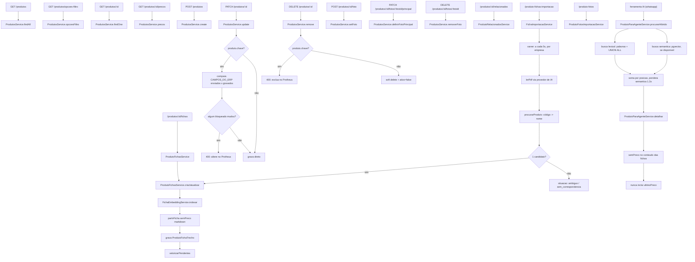

# Fluxograma — Módulo `produtos`

```mermaid
flowchart TD
    A["GET /produtos"] --> S1[ProdutosService.findAll]
    B["GET /produtos/opcoes-filtro"] --> S2[ProdutosService.opcoesFiltro]
    C["GET /produtos/:id"] --> S3[ProdutosService.findOne]
    D["GET /produtos/:id/precos"] --> S4[ProdutosService.precos]
    E["POST /produtos"] --> S5[ProdutosService.create]
    F["PATCH /produtos/:id"] --> S6[ProdutosService.update]
    G["DELETE /produtos/:id"] --> S7[ProdutosService.remove]
    H["POST /produtos/:id/foto"] --> S8[ProdutosService.setFoto]
    I["PATCH /produtos/:id/fotos/:fotoId/principal"] --> S9[ProdutosService.definirFotoPrincipal]
    J["DELETE /produtos/:id/fotos/:fotoId"] --> S10[ProdutosService.removerFoto]
    K["/produtos/:id/relacionados"] --> S11[ProdutoRelacionadosService]
    L["/produtos/:id/fichas"] --> S12[ProdutoFichasService]
    M["/produto-fichas-importacao"] --> S13[FichaImportacaoService]
    N["/produto-fotos"] --> S14[ProdutoFotosImportacaoService]

    S6 --> F1{produto.chave?}
    F1 -- sim --> F2[compara CAMPOS_DO_ERP enviados x gravados]
    F2 --> F3{algum bloqueado mudou?}
    F3 -- sim --> X1[400: altere no Protheus]
    F1 -- não --> F4[grava direto]
    F3 -- não --> F4

    S7 --> F5{produto.chave?}
    F5 -- sim --> X2[400: exclua no Protheus]
    F5 -- não --> F6[soft delete + ativo=false]

    S12 --> F7[ProdutoFichasService.criar/atualizar]
    F7 --> F8[FichaEmbeddingService.indexar]
    F8 --> F9[partirFicha semPreco markdown]
    F9 --> F10[grava ProdutoFichaTrecho]
    F10 --> F11[vetorizarPendentes]

    S13 --> F12[varrer: a cada 5s, por empresa]
    F12 --> F13[lerPdf via provedor de IA]
    F13 --> F14[procurarProduto: código -> nome]
    F14 --> F15{1 candidato?}
    F15 -- sim --> F7
    F15 -- não --> F16[situacao: ambiguo / sem_correspondencia]

    O["ferramenta IA (whatsapp)"] --> S15[ProdutoParaAgenteService.procurarHibrido]
    S15 --> F17[busca lexical: palavras + UNION ALL]
    S15 --> F18[busca semantica: pgvector, se disponivel]
    F17 --> F19[soma por posicao, pondera semantica 1.3x]
    F18 --> F19
    F19 --> S16[ProdutoParaAgenteService.detalhar]
    S16 --> F20[semPreco no conteudo das fichas]
    F20 --> X3["nunca inclui ultimoPreco"]
```
