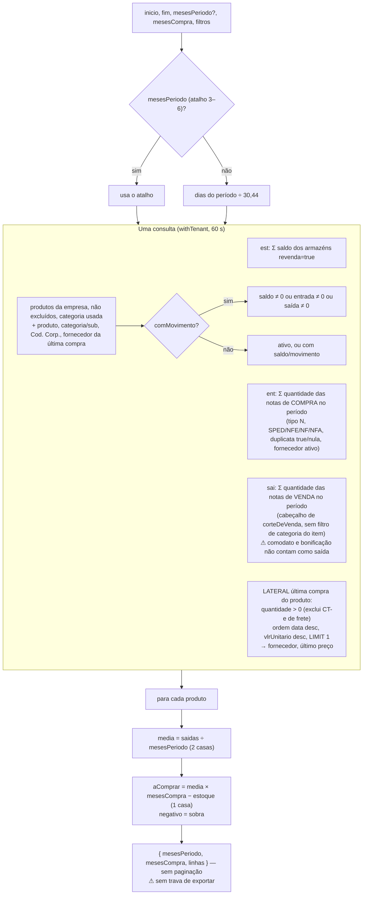

# Fluxograma — `RelatoriosService.estoqueCompra`

```mermaid
flowchart TD
    I["inicio, fim, mesesPeriodo?, mesesCompra, filtros"] --> MP{"mesesPeriodo (atalho 3–6)?"}
    MP -- sim --> MP1[usa o atalho]
    MP -- não --> MP2["dias do período ÷ 30,44"]
    MP1 & MP2 --> SQL

    subgraph SQL["Uma consulta (withTenant, 60 s)"]
      EST["est: Σ saldo dos armazéns revenda=true"]
      ENT["ent: Σ quantidade das notas de COMPRA no período<br/>(tipo N, SPED/NFE/NF/NFA, duplicata true/nula, fornecedor ativo)"]
      SAI["sai: Σ quantidade das notas de VENDA no período<br/>(cabeçalho de corteDeVenda, sem filtro de categoria do item)<br/>⚠ comodato e bonificação não contam como saída"]
      ULT["LATERAL última compra do produto:<br/>quantidade > 0 (exclui CT-e de frete)<br/>ordem data desc, vlrUnitario desc, LIMIT 1<br/>→ fornecedor, último preço"]
      PR["produtos da empresa, não excluídos, categoria usada<br/>+ produto, categoria/sub, Cod. Corp., fornecedor da última compra"]
      PR --> MOV{comMovimento?}
      MOV -- sim --> M1["saldo ≠ 0 ou entrada ≠ 0 ou saída ≠ 0"]
      MOV -- não --> M2["ativo, ou com saldo/movimento"]
    end

    SQL --> L["para cada produto"]
    L --> L1["media = saidas ÷ mesesPeriodo (2 casas)"]
    L1 --> L2["aComprar = media × mesesCompra − estoque (1 casa)<br/>negativo = sobra"]
    L2 --> OUT["{ mesesPeriodo, mesesCompra, linhas } — sem paginação<br/>⚠ sem trava de exportar"]
```
