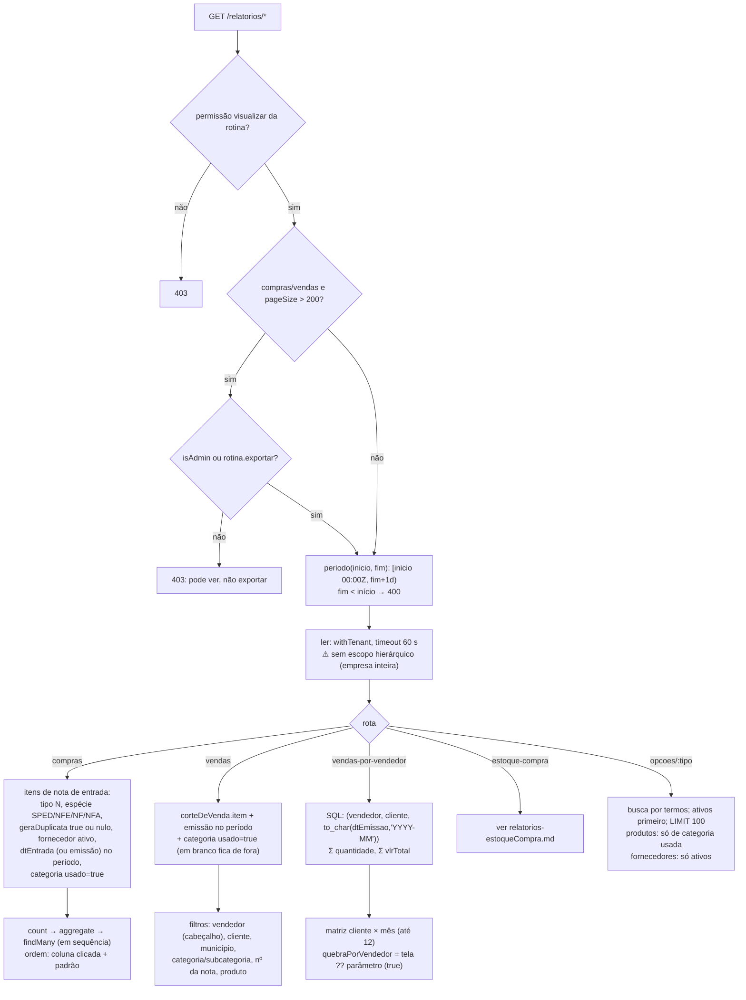

# Fluxograma — Módulo `relatorios`

```mermaid
flowchart TD
    R["GET /relatorios/*"] --> PM{"permissão visualizar da rotina?"}
    PM -- não --> F403[403]
    PM -- sim --> EX{"compras/vendas e pageSize > 200?"}
    EX -- sim --> EX1{"isAdmin ou rotina.exportar?"}
    EX1 -- não --> F403b["403: pode ver, não exportar"]
    EX1 -- sim --> P
    EX -- não --> P["periodo(inicio, fim): [inicio 00:00Z, fim+1d)<br/>fim < início → 400"]
    P --> LER["ler: withTenant, timeout 60 s<br/>⚠ sem escopo hierárquico (empresa inteira)"]

    LER --> C{rota}
    C -- compras --> CO["itens de nota de entrada:<br/>tipo N, espécie SPED/NFE/NF/NFA,<br/>geraDuplicata true ou nulo, fornecedor ativo,<br/>dtEntrada (ou emissão) no período,<br/>categoria usado=true"]
    CO --> CO1["count → aggregate → findMany (em sequência)<br/>ordem: coluna clicada + padrão"]

    C -- vendas --> VE["corteDeVenda.item + emissão no período<br/>+ categoria usado=true (em branco fica de fora)"]
    VE --> VE1["filtros: vendedor (cabeçalho), cliente, município,<br/>categoria/subcategoria, nº da nota, produto"]

    C -- vendas-por-vendedor --> VV["SQL: (vendedor, cliente, to_char(dtEmissao,'YYYY-MM'))<br/>Σ quantidade, Σ vlrTotal"]
    VV --> VV1["matriz cliente × mês (até 12)<br/>quebraPorVendedor = tela ?? parâmetro (true)"]

    C -- estoque-compra --> EC["ver relatorios-estoqueCompra.md"]

    C -- "opcoes/:tipo" --> OP["busca por termos; ativos primeiro; LIMIT 100<br/>produtos: só de categoria usada<br/>fornecedores: só ativos"]
```
