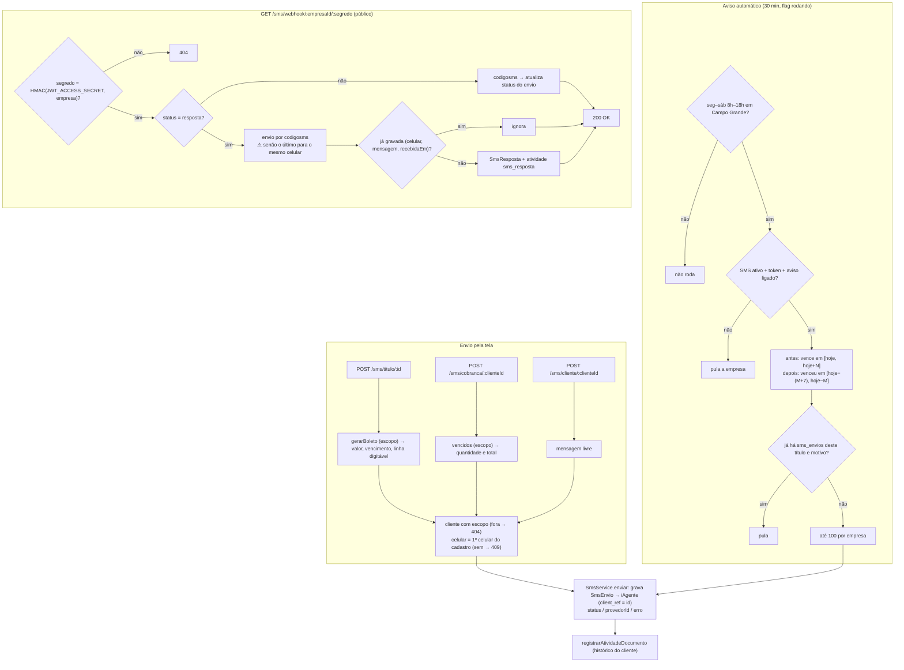

# Fluxograma — Módulo `sms`

```mermaid
flowchart TD
    subgraph Tela["Envio pela tela"]
      T1["POST /sms/titulo/:id"] --> T1a["gerarBoleto (escopo) → valor, vencimento, linha digitável"]
      T2["POST /sms/cobranca/:clienteId"] --> T2a["vencidos (escopo) → quantidade e total"]
      T3["POST /sms/cliente/:clienteId"] --> T3a[mensagem livre]
      T1a & T2a & T3a --> CL["cliente com escopo (fora → 404)<br/>celular = 1º celular do cadastro (sem → 409)"]
    end

    subgraph Auto["Aviso automático (30 min, flag rodando)"]
      A0{"seg–sáb 8h–18h em Campo Grande?"} -- não --> A0x[não roda]
      A0 -- sim --> A1{"SMS ativo + token + aviso ligado?"}
      A1 -- não --> A1x[pula a empresa]
      A1 -- sim --> A2["antes: vence em [hoje, hoje+N]<br/>depois: venceu em [hoje−(M+7), hoje−M]"]
      A2 --> A3{"já há sms_envios deste título e motivo?"}
      A3 -- sim --> A3x[pula]
      A3 -- não --> A4["até 100 por empresa"]
    end

    CL & A4 --> EN["SmsService.enviar: grava SmsEnvio → iAgente (client_ref = id)<br/>status / provedorId / erro"]
    EN --> HI["registrarAtividadeDocumento (histórico do cliente)"]

    subgraph Webhook["GET /sms/webhook/:empresaId/:segredo (público)"]
      W0{"segredo = HMAC(JWT_ACCESS_SECRET, empresa)?"} -- não --> W404[404]
      W0 -- sim --> W1{"status = resposta?"}
      W1 -- não --> W2["codigosms → atualiza status do envio"]
      W1 -- sim --> W3["envio por codigosms<br/>⚠ senão o último para o mesmo celular"]
      W3 --> W4{"já gravada (celular, mensagem, recebidaEm)?"}
      W4 -- sim --> W5[ignora]
      W4 -- não --> W6["SmsResposta + atividade sms_resposta"]
      W2 & W5 & W6 --> OK["200 OK"]
    end
```
