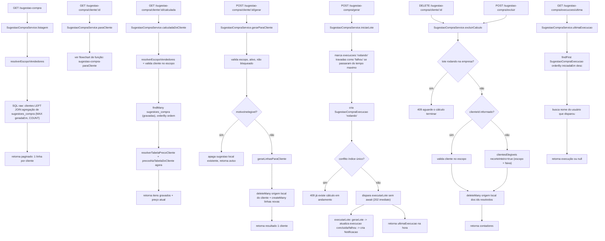

# Fluxograma — Módulo `sugestao-compra`

```mermaid
flowchart TD
    A["GET /sugestao-compra"] --> S1[SugestaoCompraService.listagem]
    B["GET /sugestao-compra/cliente/:id"] --> S2[SugestaoCompraService.paraCliente]
    C["GET /sugestao-compra/cliente/:id/calculada"] --> S3[SugestaoCompraService.calculadaDoCliente]
    D["POST /sugestao-compra/cliente/:id/gerar"] --> S4[SugestaoCompraService.gerarParaCliente]
    E["POST /sugestao-compra/gerar"] --> S5[SugestaoCompraService.iniciarLote]
    F["DELETE /sugestao-compra/cliente/:id"] --> S6[SugestaoCompraService.excluirCalculo]
    G["POST /sugestao-compra/excluir"] --> S6
    H["GET /sugestao-compra/execucoes/ultima"] --> S7[SugestaoCompraService.ultimaExecucao]

    S1 --> L1[resolverEscopoVendedores]
    L1 --> L2["SQL raw: clientes LEFT JOIN agregação de sugestoes_compra (MAX geradaEm, COUNT)"]
    L2 --> R1[retorna paginado: 1 linha por cliente]

    S2 --> P1["ver flowchart de função: sugestao-compra-paraCliente"]

    S3 --> Q1[resolverEscopoVendedores + valida cliente no escopo]
    Q1 --> Q2["findMany sugestoes_compra (gravadas), orderBy ordem"]
    Q2 --> Q3[resolverTabelaPrecoCliente + precosNaTabelaDoCliente agora]
    Q3 --> R3[retorna itens gravados + preço atual]

    S4 --> D1[valida escopo, ativo, não bloqueado]
    D1 --> D2{motivoInelegivel?}
    D2 -- sim --> D3[apaga sugestao local existente, retorna aviso]
    D2 -- não --> D4[gerarLinhasParaCliente]
    D4 --> D5[deleteMany origem local do cliente + createMany linhas novas]
    D5 --> R4[retorna resultado 1 cliente]

    S5 --> E1[marca execucoes 'rodando' travadas como 'falhou' se passaram do tempo maximo]
    E1 --> E2[cria SugestaoCompraExecucao 'rodando']
    E2 --> E3{conflito índice único?}
    E3 -- sim --> X1[409 já existe cálculo em andamento]
    E3 -- não --> E4["dispara executarLote sem await (202 imediato)"]
    E4 --> E5["executarLote: gerarLote -> atualiza execucao concluida/falhou -> cria Notificacao"]
    E4 --> R5[retorna ultimaExecucao na hora]

    S6 --> F1{lote rodando na empresa?}
    F1 -- sim --> X2[409 aguarde o cálculo terminar]
    F1 -- não --> F2{clienteId informado?}
    F2 -- sim --> F3[valida cliente no escopo]
    F2 -- não --> F4["clientesElegiveis recorteInteiro=true (escopo + faixa)"]
    F3 --> F5[deleteMany origem local dos ids resolvidos]
    F4 --> F5
    F5 --> R6[retorna contadores]

    S7 --> G1[findFirst SugestaoCompraExecucao orderBy iniciadaEm desc]
    G1 --> G2[busca nome do usuário que disparou]
    G2 --> R7[retorna execução ou null]
```
