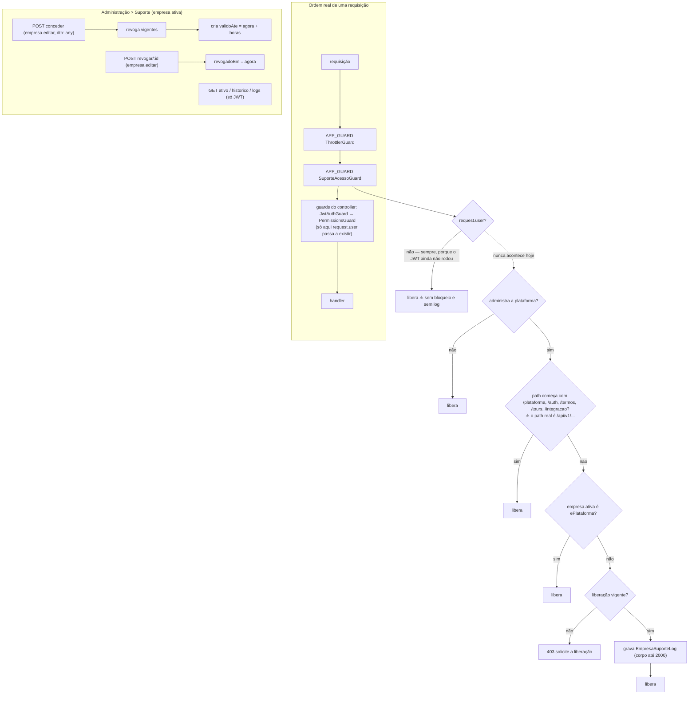

# Fluxograma — Módulo `suporte-acesso`

```mermaid
flowchart TD
    subgraph Ordem["Ordem real de uma requisição"]
      R0["requisição"] --> G1["APP_GUARD ThrottlerGuard"]
      G1 --> G2["APP_GUARD SuporteAcessoGuard"]
      G2 --> G3["guards do controller: JwtAuthGuard → PermissionsGuard<br/>(só aqui request.user passa a existir)"]
      G3 --> H[handler]
    end

    G2 --> S0{"request.user?"}
    S0 -- "não — sempre, porque o JWT ainda não rodou" --> OK["libera ⚠ sem bloqueio e sem log"]
    S0 -. "nunca acontece hoje" .-> S1{"administra a plataforma?"}
    S1 -- não --> OK2[libera]
    S1 -- sim --> S2{"path começa com /plataforma, /auth, /termos, /tours, /integracao?<br/>⚠ o path real é /api/v1/..."}
    S2 -- sim --> OK3[libera]
    S2 -- não --> S3{"empresa ativa é ePlataforma?"}
    S3 -- sim --> OK4[libera]
    S3 -- não --> S4{"liberação vigente?"}
    S4 -- não --> X403[403 solicite a liberação]
    S4 -- sim --> LOG["grava EmpresaSuporteLog (corpo até 2000)"] --> OK5[libera]

    subgraph Tela["Administração > Suporte (empresa ativa)"]
      C1["POST conceder (empresa.editar, dto: any)"] --> C2["revoga vigentes"] --> C3["cria validoAte = agora + horas"]
      V1["POST revogar/:id (empresa.editar)"] --> V2["revogadoEm = agora"]
      L1["GET ativo / historico / logs (só JWT)"]
    end
```
