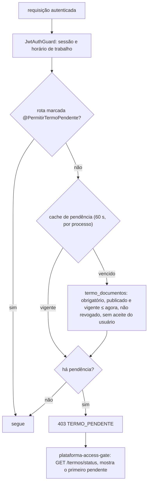
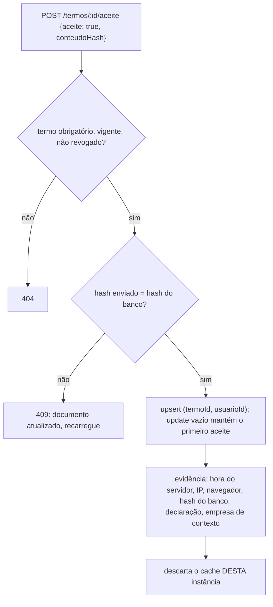
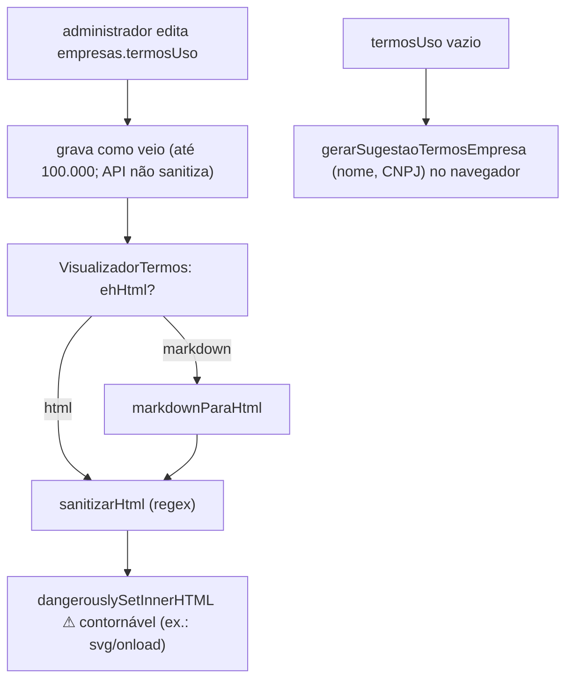

# Fluxograma — Módulo `termos`

```mermaid
flowchart TD
    REQ["requisição autenticada"] --> J["JwtAuthGuard: sessão e horário de trabalho"]
    J --> P{"rota marcada @PermitirTermoPendente?"}
    P -- sim --> OK[segue]
    P -- não --> C{"cache de pendência (60 s, por processo)"}
    C -- "vigente" --> V
    C -- "vencido" --> Q["termo_documentos: obrigatório, publicado e vigente ≤ agora, não revogado, sem aceite do usuário"]
    Q --> V{"há pendência?"}
    V -- não --> OK
    V -- sim --> X["403 TERMO_PENDENTE"]
    X --> TELA["plataforma-access-gate: GET /termos/status, mostra o primeiro pendente"]
```

```mermaid
flowchart TD
    A["POST /termos/:id/aceite {aceite: true, conteudoHash}"] --> T{"termo obrigatório, vigente, não revogado?"}
    T -- não --> E404[404]
    T -- sim --> H{"hash enviado = hash do banco?"}
    H -- não --> E409["409: documento atualizado, recarregue"]
    H -- sim --> U["upsert (termoId, usuarioId); update vazio mantém o primeiro aceite"]
    U --> EV["evidência: hora do servidor, IP, navegador, hash do banco, declaração, empresa de contexto"]
    EV --> D["descarta o cache DESTA instância"]
```

```mermaid
flowchart TD
    ED["administrador edita empresas.termosUso"] --> G["grava como veio (até 100.000; API não sanitiza)"]
    G --> VZ["VisualizadorTermos: ehHtml?"]
    VZ -- html --> S["sanitizarHtml (regex)"]
    VZ -- markdown --> MD["markdownParaHtml"] --> S
    S --> R["dangerouslySetInnerHTML ⚠ contornável (ex.: svg/onload)"]
    VAZIO["termosUso vazio"] --> SUG["gerarSugestaoTermosEmpresa (nome, CNPJ) no navegador"]
```
