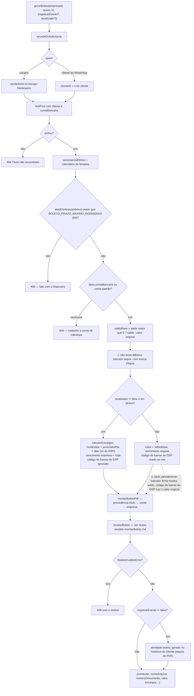

# Fluxograma — `TitulosReceberService.gerarBoleto`

```mermaid
flowchart TD
    A["gerarBoleto(empresaId, quem, id, {registrarEvento?, atualizado?})"] --> R[recorteDoSolicitante]
    R --> R1{quem}
    R1 -- usuário --> R2[vendedorId no escopo hierárquico]
    R1 -- cliente do WhatsApp --> R3[clienteId = o do cliente]
    R2 & R3 --> F[findFirst com cliente e contaBancaria]
    F --> F1{achou?}
    F1 -- não --> X404[404 Título não encontrado]
    F1 -- sim --> V["vencimentoEfetivo = calendário de feriados"]
    V --> P{"diasEmAtraso(efetivo) maior que BOLETO_PRAZO_MAXIMO_REEMISSAO (60)?"}
    P -- sim --> X409a[409 — fale com o financeiro]
    P -- não --> CB{"titulo.contaBancaria ou conta padrão?"}
    CB -- nenhuma --> X409b[409 — cadastre a conta de cobrança]
    CB -- sim --> S["saldoBase = saldo maior que 0 ? saldo : valor original"]
    S --> NB["⚠ não testa dtBaixa: baixado segue, com marca d'água"]
    NB --> AT{"atualizado != false e em atraso?"}
    AT -- sim --> ENC["calcularEncargos: multaValor + jurosValorDia × dias (só do ERP)<br/>vencimento impresso = hoje<br/>código de barras do ERP ignorado"]
    AT -- não --> ORI["valor = saldoBase; vencimento original<br/>código de barras do ERP usado se vier"]
    ENC --> M
    ORI --> M["montarBoletoPdf — precedência título → conta → empresa"]
    M --> MB[montarBoleto — ver titulos-receber-montarBoleto.md]
    MB --> E{BoletoInvalidoError?}
    E -- sim --> X409c[409 com o motivo]
    E -- não --> EV{"registrarEvento != false?"}
    EV -- sim --> AV["atividade boleto_gerado no histórico do cliente (depois do PDF)"]
    EV -- não --> RET
    AV --> RET["{conteudo, nomeArquivo, numeroDocumento, valor, encargos…}"]

    ORI -. "⚠ título parcialmente baixado: ficha mostra saldo, código de barras do ERP traz o valor original" .-> M
```
