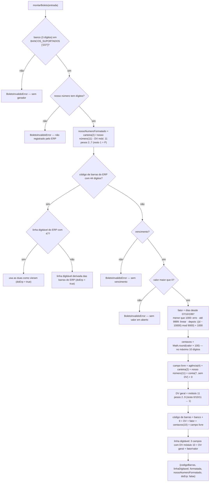

# Fluxograma — `montarBoleto` (`boleto-codigo.ts`)

```mermaid
flowchart TD
    A["montarBoleto(entrada)"] --> B{"banco (3 dígitos) em BANCOS_SUPORTADOS ['237']?"}
    B -- não --> X1[BoletoInvalidoError — sem gerador]
    B -- sim --> N{nosso número tem dígitos?}
    N -- não --> X2[BoletoInvalidoError — não registrado pelo ERP]
    N -- sim --> NF["nossoNumeroFormatado = carteira(2) / nosso número(11) - DV mód. 11 pesos 2..7 (resto 1 = P)"]
    NF --> E{"código de barras do ERP com 44 dígitos?"}
    E -- sim --> E1{"linha digitável do ERP com 47?"}
    E1 -- sim --> RE["usa as duas como vieram (doErp = true)"]
    E1 -- não --> RE2["linha digitável derivada das barras do ERP (doErp = true)"]
    E -- não --> V{vencimento?}
    V -- não --> X3[BoletoInvalidoError — sem vencimento]
    V -- sim --> VL{valor maior que 0?}
    VL -- não --> X4[BoletoInvalidoError — sem valor em aberto]
    VL -- sim --> FT["fator = dias desde 07/10/1997<br/>menor que 1000: erro · até 9999: linear · depois: ((d − 10000) mod 9000) + 1000"]
    FT --> CT["centavos = Math.round(valor × 100) — no máximo 10 dígitos"]
    CT --> CL["campo livre = agência(4) + carteira(2) + nosso número(11) + conta(7, sem DV) + 0"]
    CL --> DV["DV geral = módulo 11 pesos 2..9 (resto 0/10/11 → 1)"]
    DV --> CBAR["código de barras = banco + 9 + DV + fator + centavos(10) + campo livre"]
    CBAR --> LD["linha digitável: 3 campos com DV módulo 10 + DV geral + fator/valor"]
    LD --> R["{codigoBarras, linhaDigitavel, formatada, nossoNumeroFormatado, doErp: false}"]
```
