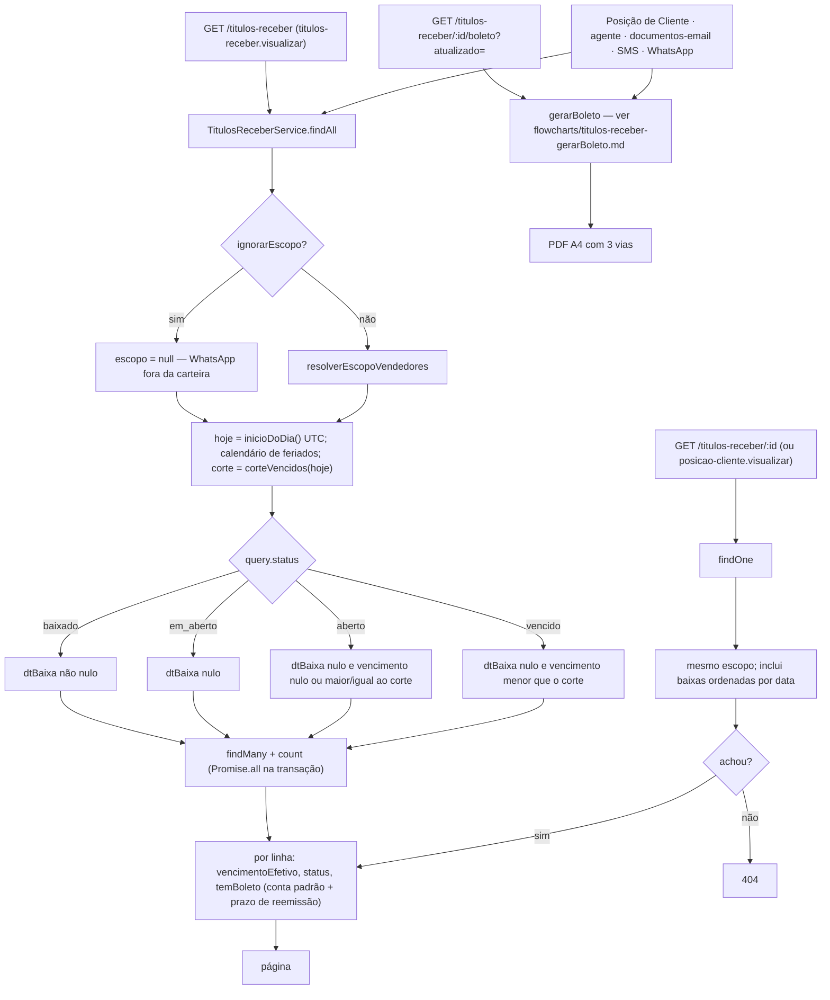

# Fluxograma — Módulo `titulos-receber`

```mermaid
flowchart TD
    L["GET /titulos-receber (titulos-receber.visualizar)"] --> FA[TitulosReceberService.findAll]
    FA --> E1{ignorarEscopo?}
    E1 -- sim --> E2[escopo = null — WhatsApp fora da carteira]
    E1 -- não --> E3[resolverEscopoVendedores]
    E2 --> C1
    E3 --> C1["hoje = inicioDoDia() UTC; calendário de feriados; corte = corteVencidos(hoje)"]
    C1 --> C2{query.status}
    C2 -- baixado --> W1[dtBaixa não nulo]
    C2 -- em_aberto --> W2[dtBaixa nulo]
    C2 -- aberto --> W3[dtBaixa nulo e vencimento nulo ou maior/igual ao corte]
    C2 -- vencido --> W4[dtBaixa nulo e vencimento menor que o corte]
    W1 & W2 & W3 & W4 --> Q["findMany + count (Promise.all na transação)"]
    Q --> D["por linha: vencimentoEfetivo, status, temBoleto (conta padrão + prazo de reemissão)"]
    D --> R1[página]

    O["GET /titulos-receber/:id (ou posicao-cliente.visualizar)"] --> FO[findOne]
    FO --> FO1[mesmo escopo; inclui baixas ordenadas por data]
    FO1 --> FO2{achou?}
    FO2 -- não --> N404[404]
    FO2 -- sim --> D

    B["GET /titulos-receber/:id/boleto?atualizado="] --> GB[gerarBoleto — ver flowcharts/titulos-receber-gerarBoleto.md]
    GB --> PDF[PDF A4 com 3 vias]

    OUT["Posição de Cliente · agente · documentos-email · SMS · WhatsApp"] --> FA
    OUT --> GB
```
