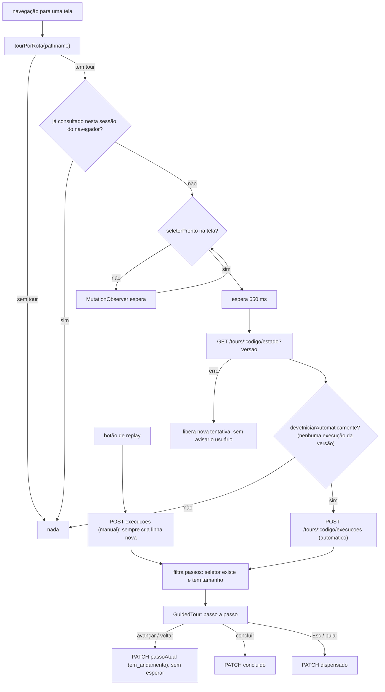
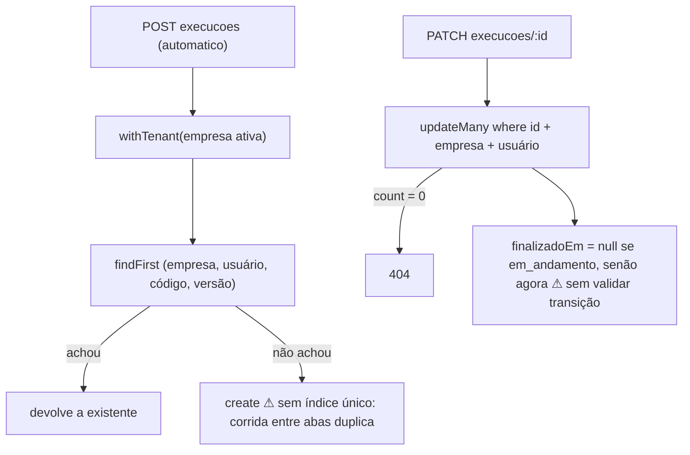

# Fluxograma — Módulo `tours`

```mermaid
flowchart TD
    NAV["navegação para uma tela"] --> TP["tourPorRota(pathname)"]
    TP -- "sem tour" --> FIM[nada]
    TP -- "tem tour" --> JA{"já consultado nesta sessão do navegador?"}
    JA -- sim --> FIM
    JA -- não --> PR{"seletorPronto na tela?"}
    PR -- não --> OBS["MutationObserver espera"] --> PR
    PR -- sim --> W["espera 650 ms"]
    W --> EST["GET /tours/:codigo/estado?versao"]
    EST -- "erro" --> RET["libera nova tentativa, sem avisar o usuário"]
    EST --> D{"deveIniciarAutomaticamente? (nenhuma execução da versão)"}
    D -- não --> FIM
    D -- sim --> POST["POST /tours/:codigo/execucoes (automatico)"]
    POST --> VIS["filtra passos: seletor existe e tem tamanho"]
    VIS --> RUN["GuidedTour: passo a passo"]
    RUN -->|"avançar / voltar"| P1["PATCH passoAtual (em_andamento), sem esperar"]
    RUN -->|"concluir"| P2["PATCH concluido"]
    RUN -->|"Esc / pular"| P3["PATCH dispensado"]
    BTN["botão de replay"] --> POSTM["POST execucoes (manual): sempre cria linha nova"] --> VIS
```

```mermaid
flowchart TD
    A["POST execucoes (automatico)"] --> B["withTenant(empresa ativa)"]
    B --> C["findFirst (empresa, usuário, código, versão)"]
    C -- achou --> R["devolve a existente"]
    C -- "não achou" --> N["create ⚠ sem índice único: corrida entre abas duplica"]
    S["PATCH execucoes/:id"] --> U["updateMany where id + empresa + usuário"]
    U -- "count = 0" --> E404[404]
    U --> F["finalizadoEm = null se em_andamento, senão agora ⚠ sem validar transição"]
```
