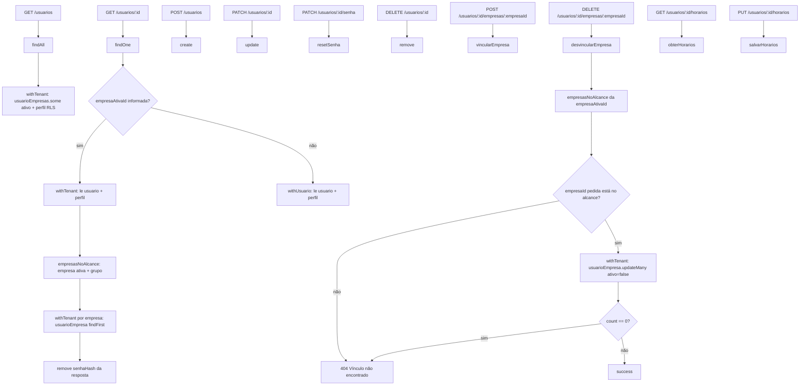
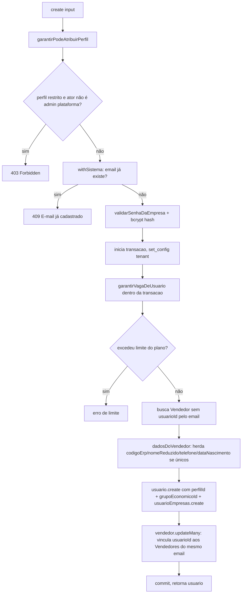
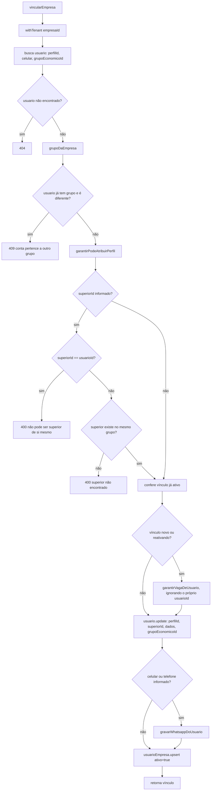
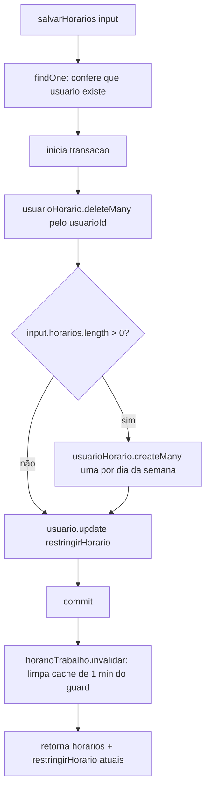

# Fluxograma — Módulo `usuarios`

```mermaid
flowchart TD
    A["GET /usuarios"] --> S1[findAll]
    B["GET /usuarios/:id"] --> S2[findOne]
    C["POST /usuarios"] --> S3[create]
    D["PATCH /usuarios/:id"] --> S4[update]
    E["PATCH /usuarios/:id/senha"] --> S5[resetSenha]
    F["DELETE /usuarios/:id"] --> S6[remove]
    G["POST /usuarios/:id/empresas/:empresaId"] --> S7[vincularEmpresa]
    H["DELETE /usuarios/:id/empresas/:empresaId"] --> S8[desvincularEmpresa]
    I["GET /usuarios/:id/horarios"] --> S9[obterHorarios]
    J["PUT /usuarios/:id/horarios"] --> S10[salvarHorarios]

    S1 --> T1[withTenant: usuarioEmpresas.some ativo + perfil RLS]
    S2 --> T2{empresaAtivaId informada?}
    T2 -- sim --> T3[withTenant: le usuario + perfil]
    T2 -- não --> T4[withUsuario: le usuario + perfil]
    T3 --> T5[empresasNoAlcance: empresa ativa + grupo]
    T5 --> T6[withTenant por empresa: usuarioEmpresa findFirst]
    T6 --> T7[remove senhaHash da resposta]

    S8 --> U1[empresasNoAlcance da empresaAtivaId]
    U1 --> U2{empresaId pedida está no alcance?}
    U2 -- não --> X1[404 Vínculo não encontrado]
    U2 -- sim --> U3[withTenant: usuarioEmpresa.updateMany ativo=false]
    U3 --> U4{count == 0?}
    U4 -- sim --> X1
    U4 -- não --> OK1[success]
```

## `create` — detalhe

```mermaid
flowchart TD
    A[create input] --> B[garantirPodeAtribuirPerfil]
    B --> C{perfil restrito e ator não é admin plataforma?}
    C -- sim --> X1[403 Forbidden]
    C -- não --> D[withSistema: email já existe?]
    D -- sim --> X2[409 E-mail já cadastrado]
    D -- não --> E[validarSenhaDaEmpresa + bcrypt hash]
    E --> F[inicia transacao, set_config tenant]
    F --> G[garantirVagaDeUsuario dentro da transacao]
    G --> H{excedeu limite do plano?}
    H -- sim --> X3[erro de limite]
    H -- não --> I[busca Vendedor sem usuarioId pelo email]
    I --> J[dadosDoVendedor: herda codigoErp/nomeReduzido/telefone/dataNascimento se únicos]
    J --> K[usuario.create com perfilId + grupoEconomicoId + usuarioEmpresas.create]
    K --> L[vendedor.updateMany: vincula usuarioId aos Vendedores do mesmo email]
    L --> M[commit, retorna usuario]
```

## `vincularEmpresa` — detalhe

```mermaid
flowchart TD
    A[vincularEmpresa] --> B[withTenant empresaId]
    B --> C[busca usuario: perfilId, celular, grupoEconomicoId]
    C --> D{usuario não encontrado?}
    D -- sim --> X1[404]
    D -- não --> E[grupoDaEmpresa]
    E --> F{usuario já tem grupo e é diferente?}
    F -- sim --> X2[409 conta pertence a outro grupo]
    F -- não --> G[garantirPodeAtribuirPerfil]
    G --> H{superiorId informado?}
    H -- sim --> I{superiorId == usuarioId?}
    I -- sim --> X3[400 não pode ser superior de si mesmo]
    I -- não --> J{superior existe no mesmo grupo?}
    J -- não --> X4[400 superior não encontrado]
    J -- sim --> K
    H -- não --> K[confere vínculo já ativo]
    K --> L{vínculo novo ou reativando?}
    L -- sim --> M[garantirVagaDeUsuario, ignorando o próprio usuarioId]
    L -- não --> N
    M --> N[usuario.update: perfilId, superiorId, dados, grupoEconomicoId]
    N --> O{celular ou telefone informado?}
    O -- sim --> P[gravarWhatsappDoUsuario]
    O -- não --> Q
    P --> Q[usuarioEmpresa.upsert ativo=true]
    Q --> R[retorna vínculo]
```

## `salvarHorarios` — detalhe

```mermaid
flowchart TD
    A[salvarHorarios input] --> B[findOne: confere que usuario existe]
    B --> C[inicia transacao]
    C --> D[usuarioHorario.deleteMany pelo usuarioId]
    D --> E{input.horarios.length > 0?}
    E -- sim --> F[usuarioHorario.createMany uma por dia da semana]
    E -- não --> G
    F --> G[usuario.update restringirHorario]
    G --> H[commit]
    H --> I[horarioTrabalho.invalidar: limpa cache de 1 min do guard]
    I --> J[retorna horarios + restringirHorario atuais]
```
