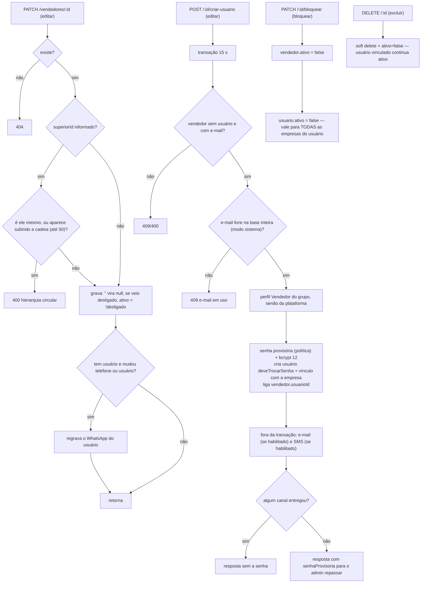

# Fluxograma — Módulo `vendedores`

```mermaid
flowchart TD
    U["PATCH /vendedores/:id (editar)"] --> U0{existe?}
    U0 -- não --> N404[404]
    U0 -- sim --> U1{superiorId informado?}
    U1 -- sim --> U2{"é ele mesmo, ou aparece subindo a cadeia (até 50)?"}
    U2 -- sim --> X400[400 hierarquia circular]
    U2 -- não --> U3
    U1 -- não --> U3["grava: '' vira null; se veio desligado, ativo = !desligado"]
    U3 --> U4{"tem usuário e mudou telefone ou usuário?"}
    U4 -- sim --> U5[regrava o WhatsApp do usuário]
    U4 -- não --> R[retorna]
    U5 --> R

    CU["POST /:id/criar-usuario (editar)"] --> T["transação 15 s"]
    T --> T1{"vendedor sem usuário e com e-mail?"}
    T1 -- não --> X409[409/400]
    T1 -- sim --> T2{"e-mail livre na base inteira (modo sistema)?"}
    T2 -- não --> X409b[409 e-mail em uso]
    T2 -- sim --> T3["perfil Vendedor do grupo, senão da plataforma"]
    T3 --> T4["senha provisória (política) + bcrypt 12<br/>cria usuário deveTrocarSenha + vínculo com a empresa<br/>liga vendedor.usuarioId"]
    T4 --> E["fora da transação: e-mail (se habilitado) e SMS (se habilitado)"]
    E --> E1{algum canal entregou?}
    E1 -- sim --> OK["resposta sem a senha"]
    E1 -- não --> OK2["resposta com senhaProvisoria para o admin repassar"]

    B["PATCH /:id/bloquear (bloquear)"] --> B1["vendedor.ativo = false"]
    B1 --> B2["usuario.ativo = false — vale para TODAS as empresas do usuário"]
    D["DELETE /:id (excluir)"] --> D1["soft delete + ativo=false — usuário vinculado continua ativo"]
```
