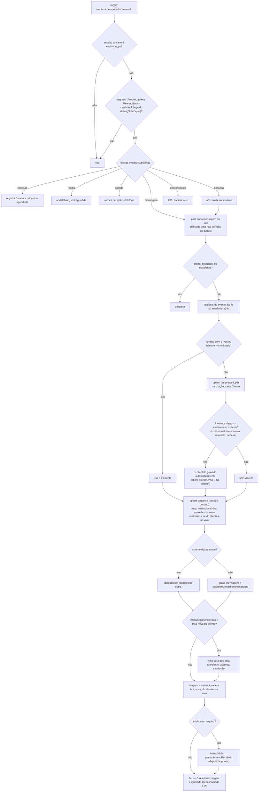

# Fluxograma — Recebimento (`webhook` → `WhatsappConversasService.receber`)

```mermaid
flowchart TD
    W["POST webhook/:empresaId/:sessaoId"] --> A1{"sessão existe e é evolution_go?"}
    A1 -- não --> U401[401]
    A1 -- sim --> A2{"segredo (?secret, apikey, Bearer, Basic)<br/>= webhookSegredo (timingSafeEqual)?"}
    A2 -- não --> U401
    A2 -- sim --> EV{"tipo do evento (substring)"}
    EV -- conexao --> C1[registrarEstado + retomada agendada]
    EV -- recibo --> C2["updateMany entregue/lida"]
    EV -- apelido --> C3["nome / par @lid↔telefone"]
    EV -- historico --> C4["lote com historico=true"]
    EV -- desconhecido --> OK200["200, tratado:false"]
    EV -- mensagem --> L["para cada mensagem do lote<br/>(falha de uma não derruba as outras)"]
    C4 --> L

    L --> R0{"grupo, broadcast ou newsletter?"}
    R0 -- sim --> DESC[descarta]
    R0 -- não --> R1["telefone: do evento; do jid só se não for @lid"]
    R1 --> R2{"contato com o mesmo telefoneNormalizado?"}
    R2 -- sim --> R3[usa o existente]
    R2 -- não --> R4["upsert (empresaId, jid)<br/>na criação: casarCliente"]
    R4 --> CC{"8 últimos dígitos = exatamente 1 cliente?<br/>(institucional: base inteira; aparelho: carteira)"}
    CC -- sim --> CC1["⚠ clienteId gravado automaticamente<br/>(libera boleto/DANFE na triagem)"]
    CC -- não --> CC2[sem vínculo]
    R3 & CC1 & CC2 --> CV["upsert conversa (sessão, contato)<br/>nova: institucional=bot, aparelho=humano<br/>naoLidas++ se do cliente e ao vivo"]
    CV --> M{"externoId já gravado?"}
    M -- sim --> M1["idempotente (corrige tipo 'outro')"]
    M -- não --> M2["grava mensagem + registrarAtendimentoWhatsapp"]
    M1 & M2 --> RE{"institucional encerrada + msg nova do cliente?"}
    RE -- sim --> RE1["volta para bot; zera atendente, assunto, saudação"]
    RE -- não --> T
    RE1 --> T["triagem = institucional em bot, nova, do cliente, ao vivo"]
    T --> MID{"mídia sem arquivo?"}
    MID -- sim --> MID1["baixarMidia → gravarArquivoRecebido (depois de gravar)"]
    MID -- não --> FIM
    MID1 --> FIM["fim — ⚠ resultado.triagem é ignorado (sem chamada à IA)"]
```
