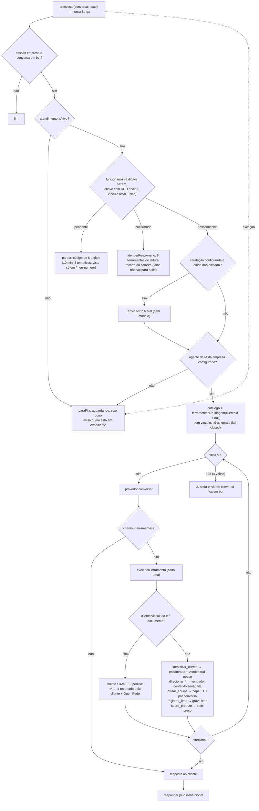

# Fluxograma — `WhatsappTriagemService.processar` (institucional)

> ⚠ Desde o commit `d7d3205` (01/10/2026) nada chama este método. O fluxo abaixo é o que o código faz quando chamado.

```mermaid
flowchart TD
    P["processar(conversa, texto) — nunca lança"] --> CX{"sessão empresa e conversa em bot?"}
    CX -- não --> FIM[fim]
    CX -- sim --> IA0{"atendimentoIaAtivo?"}
    IA0 -- não --> FILA["paraFila: aguardando, sem dono<br/>avisa quem está em expediente"]
    IA0 -- sim --> ID{"funcionário? (8 dígitos filtram,<br/>chave com DDD decide, vínculo ativo, único)"}
    ID -- pendente --> PAR["parear: código de 6 dígitos<br/>(10 min, 5 tentativas; visto só em /meu-numero)"]
    ID -- confirmado --> FUN["atenderFuncionario: 8 ferramentas de leitura,<br/>recorte da carteira (falha não vai para a fila)"]
    ID -- desconhecido --> SA{"saudação configurada e ainda não enviada?"}
    SA -- sim --> SA1["envia texto literal (sem modelo)"]
    SA -- não --> AG
    SA1 --> AG{"agente de IA da empresa configurado?"}
    AG -- não --> FILA
    AG -- sim --> CAT["catálogo = ferramentasDaTriagem(clienteId != null)<br/>sem vínculo: só as gerais (fail-closed)"]
    CAT --> LOOP{"volta < 4"}
    LOOP -- sim --> MOD[provedor.conversar]
    MOD --> CH{"chamou ferramentas?"}
    CH -- não --> RESP[resposta ao cliente]
    CH -- sim --> EX["executarFerramenta (cada uma)"]
    EX --> DOC{"cliente vinculado e é documento?"}
    DOC -- sim --> DOC1["boleto / DANFE / pedido:<br/>nº → id recortado pelo cliente + QuemPede"]
    DOC -- não --> SW
    SW["identificar_cliente → encontrado + vendedorId opaco<br/>direcionar_* → vendedor conferido senão fila<br/>avisar_equipe → papel, ≤ 3 por conversa<br/>registrar_lead → grava lead<br/>sobre_produto → sem preço"]
    DOC1 & SW --> DIR{"direcionou?"}
    DIR -- sim --> RESP
    DIR -- não --> LOOP
    LOOP -- "não (4 voltas)" --> NADA["⚠ nada enviado; conversa fica em bot"]
    RESP --> ENV["responder pelo institucional"]
    P -. exceção .-> FILA
```
