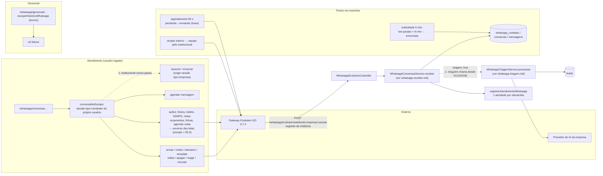

# Fluxograma — Módulo `whatsapp` (visão geral)

```mermaid
flowchart LR
    subgraph Externo
      EVO["Gateway Evolution GO 0.7.2"]
      IA["Provedor de IA da empresa"]
    end

    EVO -- "POST /whatsapp/evolution/webhook/:empresa/:sessao<br/>segredo da instância" --> WH[WhatsappEvolutionController]
    WH --> RX["WhatsappConversasService.receber<br/>(ver whatsapp-receber.md)"]
    RX --> DB[(whatsapp_contatos / conversas / mensagens)]
    RX --> AT["registrarAtendimentoWhatsapp<br/>1 atividade por cliente/dia"]
    RX -. "triagem: true<br/>⚠ ninguém chama desde 01/10/2026" .-> TR["WhatsappTriagemService.processar<br/>(ver whatsapp-triagem.md)"]
    TR --> IA
    TR --> LEAD[(leads)]

    subgraph Tela["Atendimento (usuário logado)"]
      U["/whatsapp/conversas…"] --> ESC["conversaNoEscopo:<br/>sessão tipo=vendedor do próprio usuário"]
      ESC --> ENV["enviar / mídia / interativo / template<br/>editar / apagar / reagir / vincular"]
      ESC --> AC["ações: títulos, boleto, DANFE, notas,<br/>orçamentos, fichas, agendar visita<br/>→ services das telas (escopo + RLS)"]
      ESC --> AG["agendar mensagem"]
      ESC -. "⚠ institucional nunca passa" .-> ASS["assumir / encerrar<br/>(exige sessão tipo=empresa)"]
    end
    ENV & AC --> EVO

    subgraph Gerencial
      G["/whatsapp/gerencial/…<br/>escopoHistoricoWhatsapp (árvore)"] --> RO[só leitura]
    end

    subgraph Rotinas["Timers em memória"]
      R1["agendamento 60 s<br/>pendente→enviando (trava)"] --> EVO
      R2["recado interno → equipe pelo institucional"] --> EVO
      R3["inatividade 5 min:<br/>bot parado > N min → encerrada"] --> DB
    end
```
